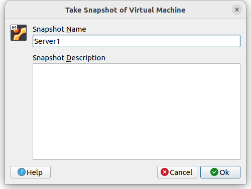

# Basic CI/CD

Development of a simple **CI/CD** for the *SimpleBashUtils* project. Building, testing, deployment.

## Contents

0. [Setting up the virtual machine by ssh to localhost](#part-1-setting-up-the-virtual-machine-by-ssh-to-localhost)
1. [Setting up the gitlab-runner](#part-1-setting-up-the-gitlab-runner)
2. [Building](#part-2-building)
3. [Codestyle test](#part-3-codestyle-test) 
4. [Integration tests](#part-4-integration-tests)
5. [Deployment stage](#part-5-deployment-stage)
6. [Bonus. Notifications](#part-6-bonus-notifications)

### Part 0. Setting up the virtual machine by ssh to localhost
This is an optional stage needed by a lazy develop who does not like to use virtual machine terminal, but wants to use copy/paste options.

1. Start *Ubuntu Server 20.04 LTS* virtual machine


1. `sudo apt install ssh`
2. `sudo apt install net-tools` for `ifconfig`
3. `sudo vim /etc/ssh/sshd_config` uncomment the line `Port: 22`
4. `sudo service ssh/sshd status` check **the active status**
5. `sudo ssh restart` or `sudo systemctl restart ssh`
6. `ifconfig` to check the virtual machine ip-address
7. close the virtual machine and go to the `Network` Settings:

Here the *Host IP* is your local machine and *Guest IP* is your VM. Please chose free *Host Port* or it won't work.


1. run `ssh user@localhost -p 2222` in the terminal of your local machine to get access to your VM

### Part 1. Setting up the **gitlab-runner**

1. Start *Ubuntu Server 20.04 LTS* virtual machine

2. Download and <a href="https://docs.gitlab.com/runner/install/linux-repository.html">install (official link)</a> **gitlab-runner** on the virtual machine
  - `curl -L "https://packages.gitlab.com/install/repositories/runner/gitlab-runner/script.deb.sh" | sudo bash`
  - `sudo apt install docker` (optional - may be used by gitlab-runner)
  - `sudo apt-get install gitlab-runner`


1. Run **gitlab-runner** and register it for use in the current project (*DO6_CICD*)
- `sudo gitlab-runner --help` - to see all the posible commands
- `sudo gitlab-runner start` - start service
- `sudo gitlab-runner register` - register a new runner

Make sure you write <a href="https://docs.gitlab.com/runner/">*the tags*</a>  for the project while registration:
>When you register a runner, you can add tags to it.
>When a CI/CD job runs, it knows which runner to use by looking at the assigned tags. Tags are the only way to filter the list of available runners for a job.
>For example, if a runner has the ruby tag, you would add this code to your project’s .gitlab-ci.yml file:
```
job:
  tags:
    - ruby
```
In other way the best way in this project is to use zero or one tag because we only use one gitlab-runner. Multiple tags are needed if you use more than one runner. 
```
URL: `https://repos.21-school.ru`
token: `<your own token>`
description: `<name>`
tags: linux
maintenance note: -
```

- `sudo gitlab-runner verify` - verify all registered runners
- `service gitlab-runner status` - to check the **active status**
*You will need a URL and a token for runner registration, that can be obtained from the task page on the platform.*


P.S. You can change your registration settings in gitlab-runner config:
- `sudo su` changes the user to root, where sudo means *execute a command as another user* and su means *substitute user identity*
- `vim /etc/gitlab-runner/config.toml`


>Use *sudo gitlab-runner list* to check runners
>Use *sudo gitlab-runner unregister -- name <runner_name>* to unregister the runner

### Part 2. Building

1. Make sure that you have all the necessary packages installed to run check stages on your VM:
   - `sudo apt install make gcc vim`
   - `sudo apt install clang-format`

2. Write a _gitlab-ci.yml_ file <a href="https://docs.gitlab.com/ee/ci/yaml/">(explore Documentation here)</a> in the root directory of your current repository and add the *Simple Bash* project to the src folder.
  - Write a stage for **CI** to build applications from the *C2_SimpleBashUtils* project.
  - In the _gitlab-ci.yml_ file, add a stage to start the building via makefile from the _C2_ project.
  - Save post-build files (artifacts) to a random directory with a 30-day retention period.


P.S. The **needs** is used to specify that both jobs (build cat and build grep) can be executed out-of-order. Relationships between jobs that use <a href="https://docs.gitlab.com/ee/ci/yaml/index.html#needs">needs</a> can be visualized as <a href="https://docs.gitlab.com/ee/ci/directed_acyclic_graph/index.html#needs-visualization">needs visualization</a> in your *GitLab/CI_CD/Pipeline/Needs*:


*Needs* helps us to control the pipeline if we get a *failure* on each of the stages:


3. Make `git push origin develop` from the current repository and check the *gitlab pipeline status*


### Part 3. Codestyle test

Write a stage for **CI** that runs a codestyle script (*clang-format*):
- If the codefile didn't pass, " fail" the pipeline
- In the pipeline, display the output of the *clang-format* utility
```
codestyle:
  stage: style
  needs: []
  tags:
    - linux
  script:
    - cd src/cat
    - make style
    - cd ../grep
    - make style
  allow_failure: false
```
Result after *push*:


P.S. Don't forget to *failure* the job with the `-Werror` flag in your Makefile. 

### Part 4. Integration tests

Write a stage for **CI** that runs your integration tests from the same project:
-  Run this stage automatically only if the build and codestyle test passes successfully
- If tests didn't pass, fail the pipeline
- In the pipeline, display the output of the succeeded / failed integration tests
```
test_code:
  stage: test
  needs:
    - job: build_code
    - job: codestyle
  tags:
    - linux
  script:
    - cd src/cat
    - make test
    - cd ../grep
    - make test
  when: on_success
  allow_failure: false
```
Result after *push*:


P.S. Don't forget to *failure* the job adding the lines to test_script.sh:
```
if (( $FAIL > 0 )); then
    exit 1
fi
```

### Part 5. Deployment stage

1. Start the second virtual machine *Ubuntu Server 20.04 LTS*
- `sudo apt install gcc make vim`
- `sudo apt install net-tools`
- `sudo apt install ssh`

Add the second adapter to each of the working virtual machines and enter the same name.


Open */etc/netplan/00-installer-config.yaml* with sudo access to make edit:
- `sudo vim /etc/netplan/00-installer-config.yaml` and make changes


- `sudo netplan apply` to save and apply changes
- `ip a` to check the changes
- `ping -c 10 <the other machine's ip address>` to check the connection

*Here the knowledge gained from the DO2_LinuxNetwork project can help you*

2. Write a stage for **CD** that "deploys" the project on another virtual machine:

>on VM1 (Server1):
  - Switch user to the user "gitlab-runner" (automatically created by the app): 
  `sudo su - gitlab-runner`
  - Now you are switched to the *gitlab-runner* user and you cam perform an automated ssh connection to the second VM (without password for the user). Use `ssh-keygen` with flag -t to specify the ssh-keygen type:
  `gitlab-runner@server1:~$ ssh-keygen -t rsa`
  - Check the newly created key:
  `gitlab-runner@server1:~$ cat .ssh/id_rsa.pub`
  - Copy the ssh-key file using flag -i (specify the file) to the second VM using the user and ip-address:
  `gitlab-runner@server1:~$ ssh-copy-id -i .ssh/id_rsa.pub <user2>@<server2>`
  - Check the connection to the second VM
  `gitlab-runner@server1:~$ ssh <user2>@<server2>`
  - Give permission to folder and all its contents using option -R (means recursively) as you already got inside the second VM:
  `user2@server2:~$ sudo chmod -R 777 /usr/local/bin`
  - Exit the ssh connection using `exit` command

3. In the _gitlab-ci.yml_ file, add a stage to run the script you have written. Run this stage manually, if all the previous stages have passed successfully. In case of an error, fail the pipeline.

```
deployment:
  stage: deploy
  needs:
    - job: build_code
      artifacts: true
    - job: test_code
  tags:
    - linux
  script:
    - bash src/copy.sh
  when: manual
  allow_failure: false
```

4. Write a bash script which copies the files received after the building (artifacts) into the */usr/local/bin* directory of the second virtual machine using **ssh** and **scp**

```
#!/bin/bash

scp ./src/cat/s21_cat user2@10.10.0.2:/usr/local/bin/
scp ./src/grep/s21_grep user2@10.10.0.2:/usr/local/bin/
ssh user2@10.10.0.2 ls -l /usr/local/bin/s21_cat /usr/local/bin/s21_grep
```
P.S. The command `ls -l $PWD/file_name` checks the existence of a named file and gives a *failure* if it is not found, you can also use one of the next commands to check the existence of the file:
```
#!/bin/bash

ls -la | egrep -w 's21_cat$' ; ls -la | egrep -w 's21_cat.c$'

test -s $PWD/s21_cat ; test -s $PWD/s21_grep

find $PWD -name s21_cat | egrep -w 's21_cat$'
find $PWD -name s21_grep | egrep -w 's21_grep$'
```

5. As a result, you should have applications from the *C2_SimpleBashUtils* (s21_cat and s21_grep) project ready to run on the second virtual machine.


1. Save dumps of virtual machine images
- Make a snapshot of both VM



- Check the directory */ Home / VirtualBox VMs / VM_name / Snapshots /*


### Part 6. Bonus. Notifications

##### Set up notifications of successful/unsuccessful pipeline execution via bot named "[your nickname] DO6 CI/CD" in *Telegram*
- The text of the notification must contain information on the successful passing of both **CI** and **CD** stages.
- The rest of the notification text may be arbitrary.

1. Create a bot using @BotFather and remember token to access the HTTP API.

2. Get your telegram ID using @getmyid_bot.

3. Create a bash script using */materials/notification.md* in the root directory of this project.
```
#!/bin/bash

TIME="10"
TELEGRAM_BOT_TOKEN=$KEYTOKEN
TELEGRAM_CHAT_ID=$CHAT_ID

STATUS=$(if [ $CI_JOB_STATUS = "success" ]; then echo "success ✅"; else echo "failure 🚫"; fi)

URL="https://api.telegram.org/bot$TELEGRAM_BOT_TOKEN/sendMessage"
TEXT="New commit by+$GITLAB_USER_NAME👩‍💻%0AProject:+$CI_PROJECT_NAME%0A\
%0AStage: ➡️+$CI_JOB_STAGE%0AStatus:+$STATUS%0ACommit title:+$CI_COMMIT_TITLE%0A\
Branch:+$CI_COMMIT_REF_SLUG%0AURL:+$CI_PROJECT_URL/pipelines/$CI_PIPELINE_ID/"

curl -s --max-time $TIME -d "chat_id=$TELEGRAM_CHAT_ID&disable_web_page_preview=1&text=$TEXT" $URL > /dev/null
```
4. Add lines to your *.gitlab-ci.yml*:
```
after_script:
  - sh src/bot.sh
```
5.Enjoy


